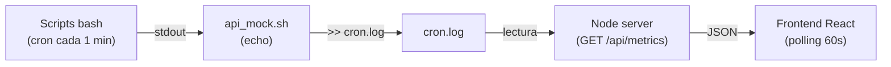
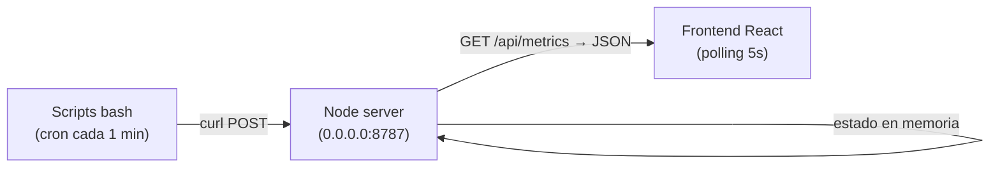
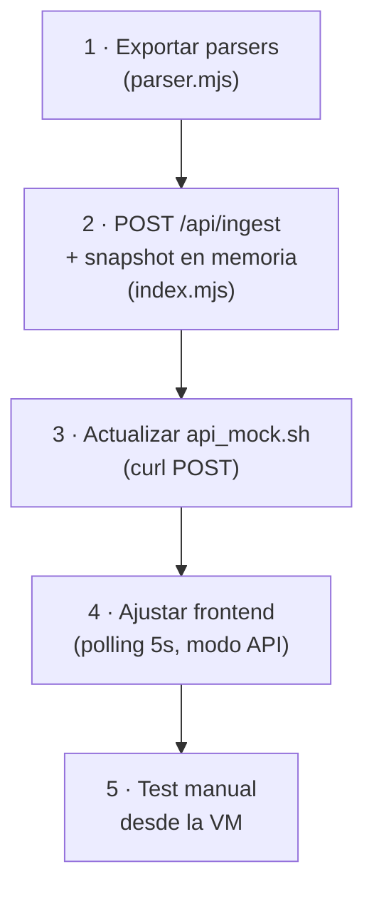

# Plan de implementación — API de monitorización en tiempo real

## Situación actual



## Arquitectura objetivo



> [!IMPORTANT]
> La API no implementa autenticación ni autorización. Cualquier cliente en la red local puede enviar o leer datos. Esto es intencional para el TP.

---

## Endpoints

### Existentes (sin cambios)

| Método | Ruta | Descripción |
|--------|------|-------------|
| `GET` | `/api/health` | Liveness check. Devuelve `{ status: "ok" }` |
| `GET` | `/api/metrics` | Snapshot completo de métricas en formato `Metrics` |

### Nuevo

| Método | Ruta | Descripción |
|--------|------|-------------|
| `POST` | `/api/ingest/:resource` | Recibe la salida cruda de un script de monitorización |

#### `POST /api/ingest/:resource`

**Parámetro de ruta:** `:resource` — uno de: `cpu`, `red`, `dispositivos_red`, `usuarios`, `memoria`, `disco`, `servicios`

**Body:** `text/plain` — la salida cruda del comando (exactamente lo que hoy se imprime entre los delimitadores de `api_mock.sh`).

**Ejemplo desde bash:**
```bash
curl -s -X POST \
  -H "Content-Type: text/plain" \
  -d "$DATOS" \
  "http://192.168.1.10:8787/api/ingest/cpu"
```

**Respuestas:**

| Código | Cuerpo | Cuándo |
|--------|--------|--------|
| `200` | `{ "ok": true, "resource": "cpu" }` | Dato recibido y parseado |
| `400` | `{ "error": "Recurso desconocido: xyz" }` | Recurso no válido |
| `400` | `{ "error": "Body vacío" }` | Sin datos en el body |
| `422` | `{ "error": "...", "resource": "cpu" }` | Dato recibido pero no se pudo parsear (se guarda el log crudo igualmente) |

**Comportamiento interno:**
1. Lee el body completo como texto UTF-8.
2. Valida que el recurso sea uno de los 7 conocidos.
3. Parsea el texto con la misma función que ya usa el parser (`parseCpu`, `parseInterfaces`, etc.).
4. Actualiza el snapshot en memoria con el resultado.
5. Acumula las últimas 60 muestras de CPU en `history`.
6. Actualiza `collectedAt` al timestamp actual.

---

## Cambios por archivo

### 1. `dashboard/server/index.mjs` — Servidor

- **Aceptar `POST`** en la lista de métodos permitidos.
- **Agregar ruta `POST /api/ingest/:resource`**: leer body, parsear con las funciones de `parser.mjs`, actualizar un objeto `snapshot` en memoria.
- **`GET /api/metrics`**: cuando hay datos en memoria, devolver el snapshot en memoria. Si no hay datos aún, intentar leer `cron.log` como fallback (comportamiento actual).
- **Bind a `0.0.0.0`** por defecto (`HOST=0.0.0.0`) para que la VM pueda llegar por la red local.
- **CORS permisivo**: aceptar cualquier origen (es red local, sin seguridad).

### 2. `dashboard/server/parser.mjs` — Parser

- **Exportar las funciones individuales** de parseo (`parseCpu`, `parseInterfaces`, `parseDevices`, `parseSessions`, `parseMemory`, `parseDisks`, `parseServices`) que hoy son privadas. No se modifica su lógica.

### 3. `bash-scripts/api_mock.sh` — Script de envío

- Reemplazar el `echo` por un `curl POST` al endpoint de la API.
- La dirección se configura con una variable `API_HOST` (default: `http://192.168.1.10:8787`).
- Fallback: si `curl` falla, imprimir la salida original a stdout para no romper el flujo con `cron.log`.

```bash
#!/bin/bash
# Envio real a la API de monitorización.
API_HOST="${API_HOST:-http://192.168.1.10:8787}"
RECURSO=$1
DATOS=$2

# Intenta enviar a la API; si falla, mantiene la salida para cron.log
if ! curl -sf -X POST \
     -H "Content-Type: text/plain" \
     -d "$DATOS" \
     "$API_HOST/api/ingest/$RECURSO" > /dev/null 2>&1; then
    echo "=== API MOCK ==="
    echo "Recurso: $RECURSO"
    echo "$DATOS"
    echo "================"
fi

exit 0
```

> [!TIP]
> Al mantener el fallback a stdout, el `cron.log` sigue funcionando si la API no está levantada.

### 4. `dashboard/src/App.tsx` — Frontend

- **Reducir el intervalo de polling** de 60s a 5s cuando está en modo `log` (API real). Esto da una experiencia cercana a tiempo real sin WebSockets.
- **Agregar modo `api`** como tercera opción en el modal de conexión (o renombrar `log` a algo más claro como "Servidor remoto").
- No se necesitan cambios en los componentes de visualización — el shape de datos es exactamente el mismo.

### 5. `bash-scripts/monitor_todo.sh` — Orquestador

- Actualizar las rutas de los scripts si es necesario para el entorno de la VM.

---

## Orden de implementación



| Paso | Archivo(s) | Estimación |
|------|-----------|------------|
| 1 | `parser.mjs` | 5 min |
| 2 | `index.mjs` | 20 min |
| 3 | `api_mock.sh` | 5 min |
| 4 | `App.tsx` | 10 min |
| 5 | Test manual | 10 min |

---

## Fuera de alcance (decisión explícita)

- **WebSockets / SSE**: polling de 5s es suficiente para el TP y evita complejidad.
- **Persistencia en disco**: los datos viven en memoria del servidor. Si se reinicia, los scripts vuelven a enviar en el siguiente minuto de cron.
- **Autenticación / rate limiting**: no aplica (red local, TP).
- **FastAPI / Python**: el servidor Node ya existe, no se justifica agregar otra tecnología.
- **Next.js**: el frontend Vite+React funciona perfecto, no hay razón para migrar.
